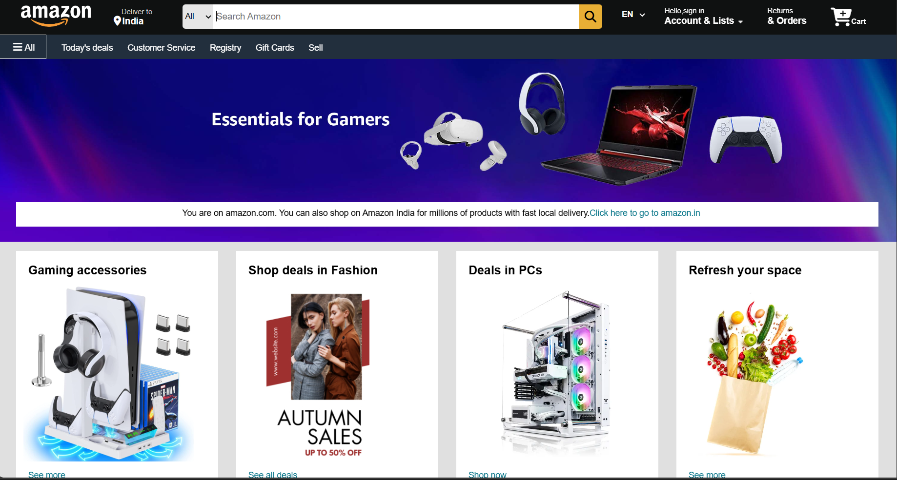
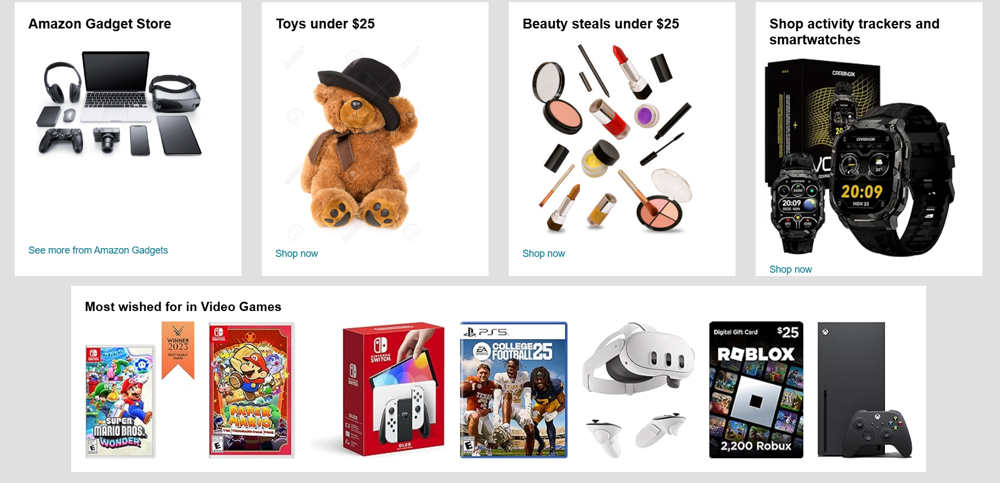
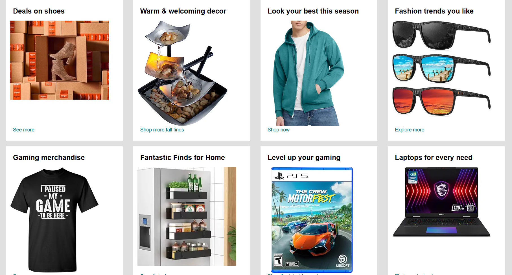
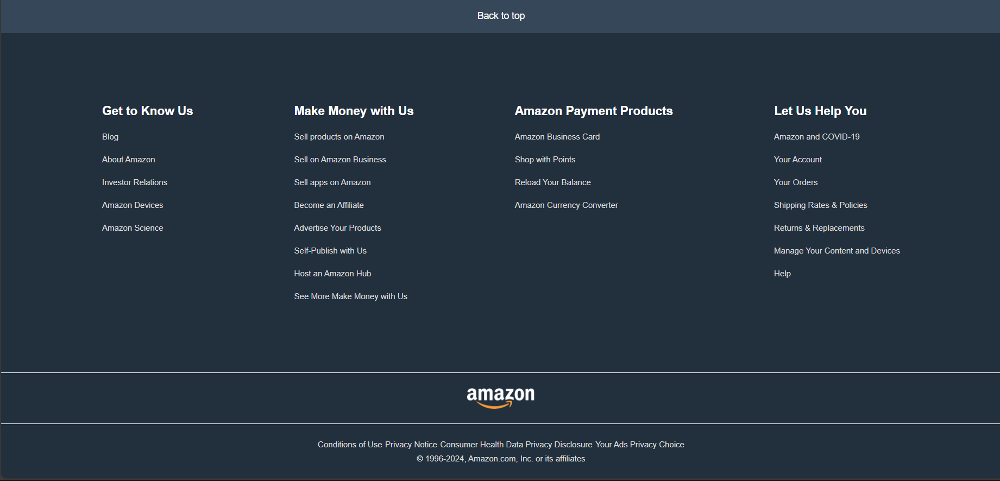

# Amazon UI Clone

## Table of Contents
- [Preview Images](#preview-images)
- [Features](#features)
- [File Structure](#file-structure)
- [Images](#images)
- [How to Use](#how-to-use)
- [Important Notes](#important-notes)

## Preview Images

This project is a static Amazon UI Clone that simulates the design of the popular online shopping platform. The layout includes various sections such as a navigation bar, search bar, user account area, and product listings. **Please note that this layout is not responsive** and is intended for desktop view only.

## Features

- **Navigation Bar:** Includes a logo, search bar, language selector, user account information, and shopping cart icon.
- **Main Section:** A hero image section that can be used for promotional content.
- **Product Sections:** Multiple product display boxes for showcasing items.
- **Footer:** Includes additional navigation links, legal information, and a final logo.

## File Structure

- **index.html:** The main HTML file containing the structure of the webpage.
- **style.css:** The CSS file containing all styles applied to the HTML structure.
- **images/**: A directory containing images used in the layout (e.g., logos, hero image, product images).

## Images

Place the following images in the `images/` directory:

1. **Logo Image:** `amazon_PNG11.png` - This image is used as the logo in the navigation bar and footer.
2. **Hero Image:** `main.jpg` - The main background image for the hero section.
3. **Product Images:** Add at least 4 product images named `product1.jpg`, `product2.jpg`, `product3.jpg`, and `product4.jpg`. These will be displayed in the product sections.
4. **Additional Images:** Any other images required for different sections of the layout.

## How to Use

1. Clone the repository to your local machine.
2. Ensure that all image files are placed in the `images/` directory.
3. Open `index.html` in your preferred web browser to view the layout.
4. Modify the HTML and CSS files to fit your content or design requirements.

## Important Notes

- **Non-Responsive Layout:** This layout is designed for desktop view and does not include responsive features for mobile or tablet devices.
- **Static Design:** This project is a static layout and does not include any dynamic features like user authentication, database interaction, or real-time updates.
